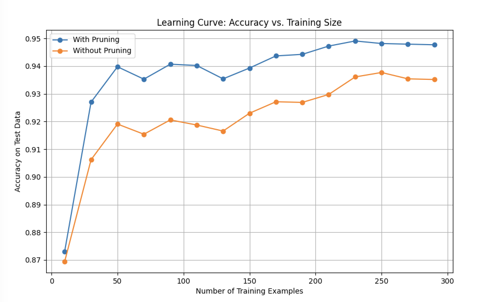
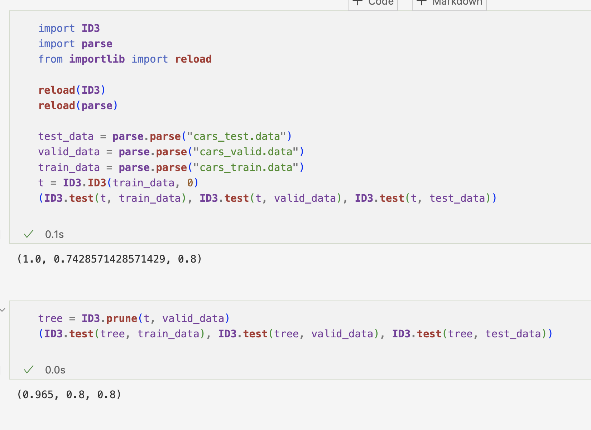

# Notice 

Contrary to the original specification of the program where `ID3.pruning()` has no `return` and updates the input `tree` directly, the same function in our submission returns the pruned tree based on a copy of `tree`. This is because we for the life of us couldn't figure out why we cannot use the function, which has a nested helper function in it, to update `tree` directly. 

  As a result, we also changed ONLY ONE line of code (line 71 in this submission is changed to `tree = ID3.prune(tree, valid)` from `ID3.prune(tree, valid)`) in unit_tests.py to make sure `unit_test.testPruningOnHouseData()` work. 
  

# 1. 

We did alter the Node data structure. We added `self.decision_label` in the node's init function and added two helper functions: `add_label` and `add_decision_label`.

We have these two function so that we can use the add_label function for all the leaf node in the decision tree, and `add_decision_label` for nodes that are not terminal and are used to determine which attribute will be used for that node.

# 2. 

We left missing attribute as it is. This is because the algorithm still works with doing so and the learning curve looks alright where the training data contains data with missing attributes. When it comes to missing attributes in test sets, we treated the missing attribute as the first value of the same label (see `ID3.test()`)  
# 3. 

The pruning strategy is roughly as follows:

In tree t, for every interior node, n:

  (1) Find the corresponding majority class label, l, from the test data. 
  
  (2) Let t' = t.copy(). Replace the n in t' with node {children: {}, label: l, decision label: None}
  
  (3) If ID3.test(t') > ID3.test(t), update t with t'
  
This strategy is justified by the fact that we have a good learning curve (see sec. 4 below), and the fact that it works on `cars_train.data, cars_valid.data, cars_test.data`, a small data set.

# 4.

At each size, the data is shuffled every time the program is run. The sizes of validation set and test set are kept constant.

(i) The two accuracies seem to steadily increase. Think of the training set as sampled data, and the whole data set as all the data points in the universe. Then it is obvious that the bigger the traning set, then the more extensive and representative is the sampling, hence less likely there are outliers in the test set. (Suppose that you've observed 4/5 of the swans in the world, then it is much less likely that you'll say "all swans are white" compared to someone who's only seen 100 swans in their life).

(ii) The advantage, measured as the difference between the two accuracies, seems to decrease. Because, pruning can be seen as reducing bias of a hypothesis, and the bigger the training set, the more extensive is the sampling, and hence less likely is the sampling biased. 

# 5.

After pruning, the accuracy on train_data decreases: this is because before pruning, the model overfits the training set. The accuracy on valid_data increases: this is obvious, since the program prunes the tree with reference to how well it fits validation set. The accuracy on test_set remains the same. This is non-surprising: the data set is very small.  

# 6. 
Design of random forest:
We chose to train 10 trees in the forest because the dataset for candy is not large, so ten trees is a suitable number of trees to balance the cost and performance.
Each tree is trained on a sample of the original dataset, which creates different subsets for training. We are using the random feature to increase the accuracy. Random features will help reduce the correlation which can reduce overfitting. Each tree randomly selects the features to split the node, which will make the forest more robust. For the prediction, we used the ID3 algorithm to train each tree and did the comparison based on information gain, which can lead to more effective classification.

Accuracy comparison:

ID3 Decision Tree Accuracy: 82.35%
Random Forest Accuracy: 88.24%

The comparison between the results of a single decision tree generated by ID3 and the random forest is achieved by using the evaluation function from randomForest class and the test function from the ID3 class. Using the predictAll method, a list of predictions is generated using the test set. Compared with the actual value from the test set, accuracy is gained slightly for the randomForest prediction. Compared with the accuracy of the single decision tree prediction from the ID3, we conclude that the randomForest prediction is more accurate than the ID3 in prediction.

